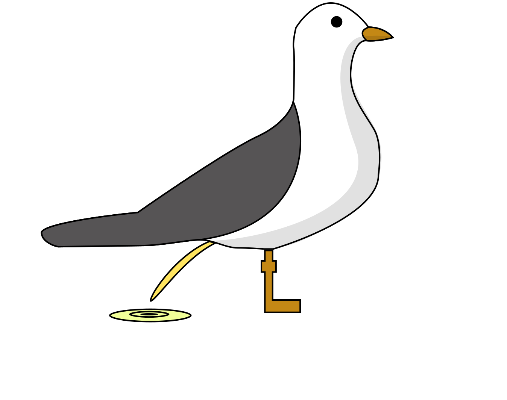

<p align="center">
  
</p>

# pisstaube

[](https://pisstau.be/discord)

Crawls down osu!API v2 and Cheesegull API to create the best osu!Mirror experience Possible!

# Requirements

### Knowledge
you'll need Prior knowledge in C# and .NET Core 3 if you want to use this Beatmap Mirror!

### Dependencies
* [Docker (For Production)](https://www.docker.com/)
* [Dotnet Core 3.1](https://dotnet.microsoft.com)
* [ElasticSearch](https://www.elastic.co/de/)

# Setup pisstaube

the easiest way would be docker i guess, simply run those commands (!WARNING! DO NOT RUN UNTRUSTED COMMANDS IF YOU DON'T KNOW WHAT THEY DO!):
```console
:~$ git clone https://github.com/Pisstaube/pisstaube.git
:~$ cd pisstaube
:~$ cp docker.env.example docker.env # PLEASE EDIT YOUR docker.env! as it's our config file
:~$ docker-compose up --build -d
```

i do not recommend setting it up though,
as we don't want to make peppy mad by using too much of his valuable bandwidth.

That's why i've setup my own mirror at [pisstau.be](https://pisstau.be) where it basically stores EVERY SINGLE BEATMAP that has been downloaded at least once.

# License

Pisstaube's code is licensed under the [MIT licence](https://opensource.org/licenses/MIT).
Please see [the licence file](./LICENSE) for more information.
[tl;dr](https://tldrlegal.com/license/mit-license) you can do whatever you want as long as you include the original copyright and license notice in any copy of the software/source.
